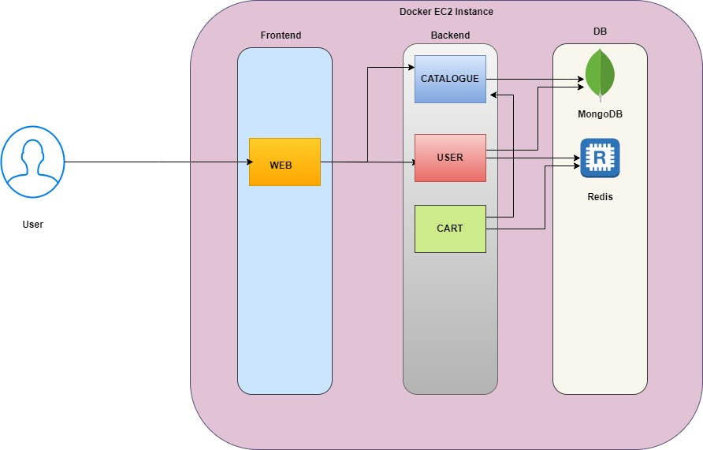

### Roboshop using Docker

Roboshop is a sample popular Microservices application. It is owned by Instana which is acquired by IBM. They use this project in their product developments like instana APM tool and other products. It has all the services used for an ideal ecommerce company.

We are going to create Docker images for every service and deploy them as Docker containers in EC2 instance.

